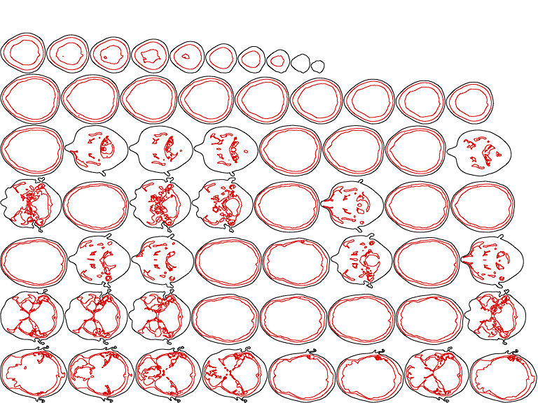

Laser Slicer
============

A script which converts 3D volumes into contour sets which can be cut out on a
laser cutter. For example:

How to Use it
-------------

First, convert a series of images ("slices") to a 3D array which lives in an
HDF5 file. You can use the ``dicom_to_h5.py`` script to do this if your images
are in the `DICOM <http://en.wikipedia.org/wiki/DICOM>`_ file format.

Then, create a parameters file for your data. The parameters file uses the JSON
file format. It contains a single object at the top level that contains the
following names/values:

* ``output_name`` (**required**): The name of the PDF file where the output is
  written.
* ``output_width`` (**required**): The width of each page, in inches.
* ``output_height`` (**required**): The height of each page, in inches.
* ``output_dpi`` (**required**): The DPI of the output. 72 DPI is a safe value.
* ``hairline_width`` (**optional**): The width of a line, in inches. NOTE: This
  can be ignored if the laser cutter you are using doesn't use the thickness
  of lines to determine whether they should be raster or vector. For Corel
  Draw, this value is 0.001".
* ``scale_factor`` (**optional**): A scale factor to be applied to each slice.
* ``text_color`` (**required**): The color of the index number written on each
  slice.
* ``voxel_dims`` (**optional**): The dimensions of a voxel in millimeters.
  NOTE: This is a combination of DICOM ``PixelSpacing`` and ``SliceThickness``
  attributes
* ``contours`` (**required**): A list of objects with the following
  names/values:

  * ``isovalue`` (**required**): The isovalue of the contour
  * ``last_slice`` (**required**): The last slice to extract this contour from
  * ``color`` (**required**): The color of this contour in the output

* ``contour_bbox_index`` (**optional**): Which contour to derive the a slice's
  bounding box from. Defaults to 0 if not specified.
* ``contour_bbox_padding`` (**optional**): An amount of padding, in inches, to
  add as a border around each slice in the output.
* ``clip_boxes`` (**optional**): A list of rectangles, (X, Y, Width, Height)
  lists, where contours should be clipped from the final output. The
  coordinates are in pixels, relative to the original image data.
* ``clip_overlap_percentage`` (**optional**): An overlap percentage used to
  determine whether a contour should be clipped by a clip_box.
* ``registration_marks`` (**optional**): A list of objects with the following
  names/values:

  * ``points`` (**required**): A list of (X, Y) points in the mark
  * ``color`` (**required**): The color of the mark.

See the ``sample_params.json`` file for an example of a working parameters
file.

Finally, feed the HDF5 and parameters file to the program::

  python slicer.py -n <Array Node Path> -p <Params File> <HDF5 file>

You'll probably need run the script many times to figure out good parameters
for your data.

Dependencies
------------
* `Enable <http://github.com/enthought/enable>`_
* `numpy <http://www.numpy.org/>`_
* `pydicom <https://code.google.com/p/pydicom/>`_ (for `dicom_to_h5.py`)
* `PyTables <http://www.pytables.org>`_
* `ReportLab <http://www.reportlab.com/opensource/>`_
* `Scikit-image <http://scikit-image.org/>`_
